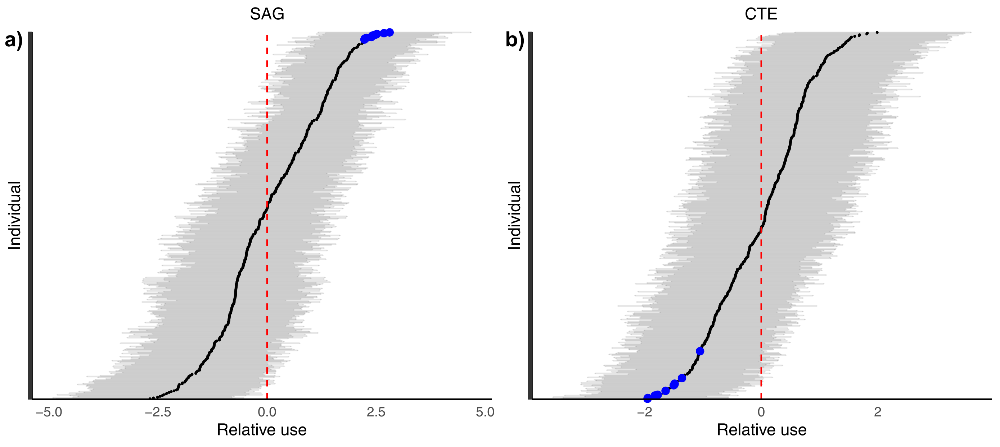
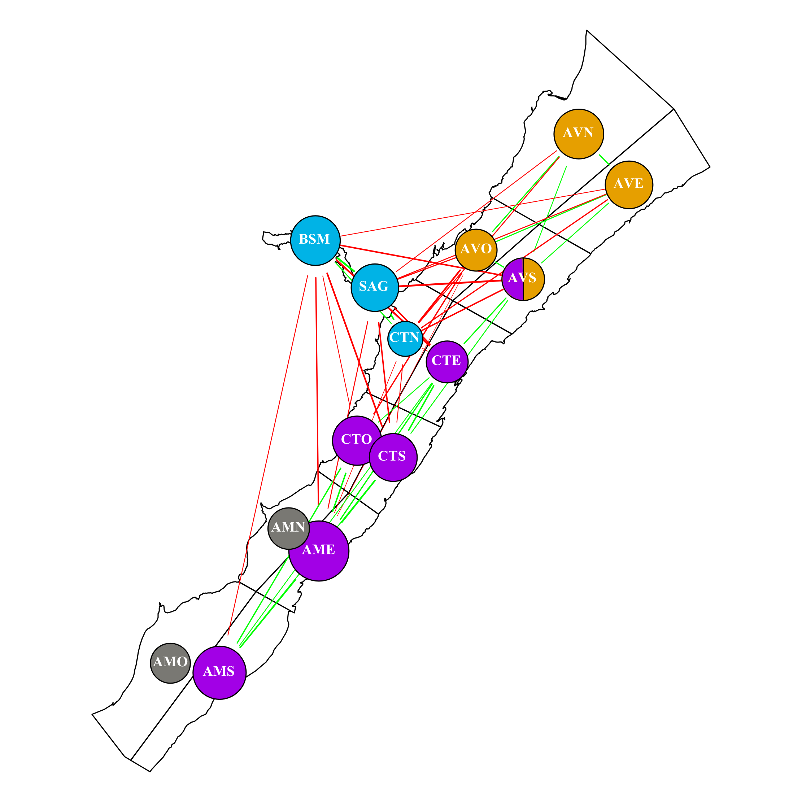

# Multilevel multinomial models as a tool to extract population spatial networks from capture-recapture data
 

### Abstract: 
1.	Capture-recapture of individuals within a population is a common method in wildlife studies for understanding population dynamics and habitat use. Spatial and temporal patterns in individual captures, however, are often biased by sampling effort, limiting effective sample size and conclusions that can be drawn from capture-recapture analyses.
2.	Here, we illustrate the potential for multilevel multinomial models to generate spatial networks from capture-recapture data, while accounting for associated sampling effort biases. These spatial networks capture which regions of a population’s spatial distribution share similar/dissimilar individual usage patterns, and can be especially useful for detecting substructures within the larger population.
3.	Using simulations and 18 years of capture recapture data from St. Lawrence Estuary (SLE) beluga, we show that this approach can successfully estimate the magnitude of similarities/dissimilarities in individual usage patterns across sectors, and identify sectors that share similar individual usage patterns that differ from other sectors, i.e., population spatial structure. In the case of SLE beluga, this method identified multiple clusters of individuals, each preferentially using restricted areas within their summer range of the SLE. 
4.	We conclude that multilevel multinomial models can be effective at estimating spatial structure in habitat use within wildlife populations sampled non-uniformly by capture-recapture of individuals. These findings are important for conservation as they provide a means for exploiting these imperfect but widespread datasets to better understand habitat use and estimate impacts of localized anthropogenic stressors, such as chemical pollution or acoustic disturbances on animal populations.
 
 
 
### Code:

 In this paper we used brms to build and run a multilevel multinomial model to create population-level spatial networks. See [this link](https://github.com/tbonne/photoID_multinomial/blob/main/R/multinomial_code.Rmd) for more detailed code, but below is the general formula used:
 
  bf(y | trials(totsize) ~ 1 + (1|p|ID)) + multinomial()
  
 Here 'y' is a column vector with the number of times a beluga was seen in each sector of the St. Lawrence Estuary. 'Totsize' is the total number of times that beluga was seen, and 'ID' is the individual beluga ID number. The additional 'p' in the random effects formula (1|p|ID) allows correlations between individual random intercepts (i.e., beluga usage patterns) to be calculated between sectors.
 
 
### Visualizations:
 We can visualize these correlations between beluga usage patterns (i.e., similarities in individual random intercepts) between sectors:
 
 
 
 *Figure 1: Estimate of the relative use (i.e., deviation from mean use) for each individual within the SAG (a) and CTE sectors (b) of the St. Lawrence beluga summer habitat. The values are deviations from the mean probability of observing individuals within a sector and are on the logit scale. The red dashed line represents the mean use, black points represent the estimated deviation from the mean, while the horizontal grey lines represent the 95% credible interval. To highlight how correlations are estimated between sectors, the estimated top 10 users of the SAG sector are represented by blue dots (panel a), and those same individuals are also highlighted in blue in the CTE sector (panel b).*
 
 
 We also use these between sector correlations to create a population spatial network defining similarity/dissimilarity in beluga usage patterns within the St.Lawrence Estuary:
 
 

*Figure 4: Similarity and dissimilarity between sectors in the beluga whale population of the St. Lawrence. The green edges between two sectors signify that the sectors share high/low users, while red edges signify that they have dissimilar high/low users. The lack of an edge signifies that the high/low users of one sector does not provide information about the high/low users of other sectors. Nodes represent sectors, and are coloured based on shared communities: i.e., shared green edges, and no red edges. Node sizes represent the magnitudes of individual differences in use within the sector, i.e., larger nodes suggest larger differences between high and low users.*
